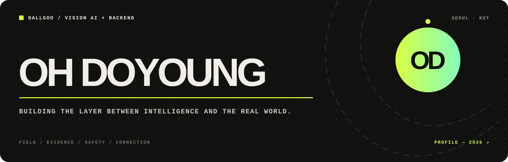

<p align="center">
  
</p>

### Vision AI를 실제 현장에서 작동하는 제품으로 연결합니다.

현재 **[DALLGOO](https://dallgoo.com/about)**에서 응급의료 현장을 위한 Vision AI 애플리케이션과 백엔드 시스템을 만들고 있습니다. 모델의 결과가 데모에 머무르지 않고, 앱과 API를 거쳐 사용자의 판단과 행동으로 이어지게 하는 일에 집중합니다.

`Vision AI Application` · `Backend Engineering` · `Real-time Systems` · `AI Product`

---

### Current — DALLGOO

> 현장–구급차–병원 사이의 정보 공백을 줄이는 기술을 만듭니다.

- Vision AI 기능을 모바일·웹 애플리케이션의 실제 사용 흐름으로 연결
- AI 모델과 클라이언트를 잇는 백엔드 API 및 데이터 흐름 설계
- 실시간 처리, 안정적인 상태 전달, 장애를 추적할 수 있는 운영 환경 구축
- 의료 현장에서 이해하기 쉬운 피드백과 안전한 사용자 경험 고민

<sub>회사 내부 구현·데이터·알고리즘은 공개하지 않으며, 위 내용은 공개된 제품 방향과 제 역할의 범위를 설명합니다.</sub>

---

### Selected Public Work

| Project | What I built | Proof |
| :--- | :--- | :--- |
| **[Backend Field Manual](https://github.com/ohdoyoung/-backend-field-manual)** | 실패 재현과 완료 증거를 중심으로 설계한 백엔드·AI 실전 교재 | 160 classes · FastAPI · AI/CV/RAG |
| **[취약했네](https://github.com/ohdoyoung/secure-check)** | 코드 보안 결과를 건강검진처럼 보여주는 SAST MVP | 166 rules · Spring Boot · React |
| **[ctx](https://github.com/ohdoyoung/ctx-gc)** | 긴 에이전트 작업의 검증 가능한 상태를 보존하는 Codex skill | 60 valid evaluation runs |
| **[SkillResidue](https://github.com/ohdoyoung/-SkillResidue)** | 스킬이 무관한 후속 작업에 남기는 행동 잔류를 측정하는 실험 프로토콜 | 26/26 behavioral checks |
| **[SoundScape](https://github.com/ohdoyoung/SoundScape)** | 음악과 감정을 기록하고 추천으로 연결하는 iOS 앱 | SwiftUI · Core Data · Music APIs |

---

### Engineering Range

```text
Vision AI output
      ↓
Backend API · real-time data flow
      ↓
Mobile / Web application
      ↓
Observable, safe product in the field
```

**Backend**  
`Python` `FastAPI` `Flask` `Java` `Spring Boot` `REST API` `WebSocket`

**Data & Operations**  
`Redis` `MySQL` `Docker` `Linux` `Testing` `Logging` `CI/CD`

**Application**  
`SwiftUI` `Flutter` `React` `TypeScript`

**AI Engineering**  
`Vision AI` `Computer Vision` `Model Integration` `AI Agent Tools`

---

### Trajectory

```text
2019  Web interfaces
  ↓
2025  Mobile & AI applications
  ↓
NOW   Vision AI · Backend · Emergency medical systems
```

저는 기술 스택의 개수보다 **실패를 재현하고, 결과를 측정하고, 복잡한 시스템을 사람의 언어로 보여주는 능력**을 중요하게 생각합니다.

---

### Find me

[GitHub](https://github.com/ohdoyoung) · [Tistory](https://dhehdud456.tistory.com/) · [DALLGOO](https://dallgoo.com/about)

<sub>Building tools for the moment when software has to work—not just look convincing.</sub>
